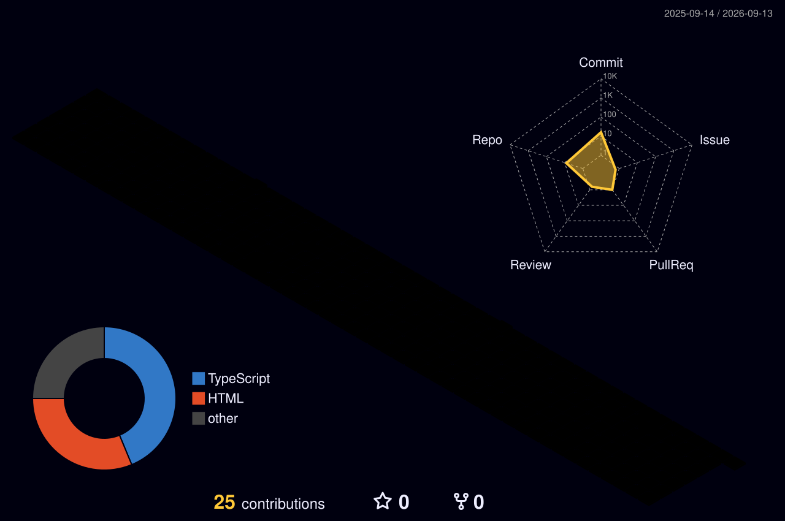

<!-- 
=========================================================
  Hello! Welcome to your dynamic GitHub Profile README!
=========================================================
-->

<!-- Premium Animated Banner -->

<!-- Typing Animation -->

 

<!-- Social Badges -->

  
  
  <!-- Update these links with your actual handles if you have them! -->
  

---

### 👨‍💻 About Me

I am a passionate **Full Stack Developer** with **8 years of experience** crafting high-performance, scalable web and mobile applications. I thrive on architecting solid backends and bringing designs to life with beautiful, intuitive frontend experiences. 

- 🚀 Currently building amazing digital products and scaling platforms.
- 💡 Exploring and learning **Python, Go lang, and Rust**.
- 💬 Ask me about **React, Node.js, Next.js, and App Development**.
- 📫 Reach out to me on my [LinkedIn](https://www.linkedin.com/in/vipin-chauhan-08a37b421?utm_source=share_via&utm_content=profile&utm_medium=member_android) or through my [Portfolio](https://vipdev.in/).

---

### 🛠️ Tech Stack & Skills

<b>Frontend Development</b> (Click to expand)

 

  

<i>(Includes React Native, Expo, and Flutter for Mobile Development)</i>

<b>Backend & Databases</b> (Click to expand)

 

  

<i>(Also skilled in CodeIgniter, Socket.io, and WebRTC)</i>

<b>Tools & Platforms</b> (Click to expand)

 

  

---

### 🏆 GitHub Trophies

  

---

### 📊 GitHub Stats & Metrics

  
  

 

  
  

---

### 🐍 Contribution Grid Snake

> The snake automatically eats my contributions on the grid and grows!

  <!-- This image will be generated by the GitHub Actions Workflow (snake.yml) -->
  <!-- You must run the workflow at least once for this image to appear! -->
  <picture>
    <source media="(prefers-color-scheme: dark)" srcset="dist/github-snake-dark.svg">
    <source media="(prefers-color-scheme: light)" srcset="dist/github-snake.svg">
    
  </picture>

---

### 🧊 3D Contribution Calendar

> Explore my open-source commits in 3D!

  <!-- Generated by profile-3d-contrib.yml GitHub Action -->
  

---

### ⚙️ Integrations & More (Setup Required)

> **Hey Vipin!** To activate these widgets, replace `YOUR_USERNAME` with your actual usernames on those platforms. 

<b>LeetCode & Codeforces</b>

 

  
    
  <!-- Replace YOUR_CODEFORCES_USERNAME -->
  

<b>WakaTime Coding Activity</b>

 

  <!-- You need to add a WakaTime card generator or use github-readme-stats wakatime integration (requires setting up a Vercel instance with your WakaTime API Key) -->
  

<b>Spotify Now Playing</b>

 

  <!-- Setup novatorem/novatorem or use metrics API to display what you're listening to -->
  

<b>Latest Blog Posts & YouTube Videos</b>

 

<!-- These tags are used by the blog-post-workflow Action to inject links -->
#### 📝 Recent Blogs
<!-- BLOG-POST-LIST:START -->
*Configure the blog-post-workflow in `.github/workflows` to show your posts!*
<!-- BLOG-POST-LIST:END -->

#### 🎥 Recent Videos
<!-- YOUTUBE:START -->
*Configure the youtube workflow in `.github/workflows` to show your videos!*
<!-- YOUTUBE:END -->

---

  <h3>Thanks for visiting! 😊</h3>
  
   
   
  
<i>"Code is like humor. When you have to explain it, it’s bad."</i>

  

